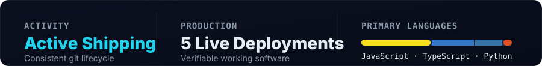

  

  
  &nbsp;
  <!-- TODO: Insert public resume link -->
  
  &nbsp;
  
  &nbsp;
  
  &nbsp;
  

 

 

 

<h2></h2>

<!-- 2x2 Selected Work Grid -->
<table width="100%">
  <tr>
    <!-- Card 1: AI Chatbot Assistant -->
    <td width="50%" valign="top">
      <a href="https://ai-chatbot-f3t9.vercel.app">
        <!-- TODO: Replace placeholder with actual 1200x630 screenshot when available -->
        
      </a>
        
      <b>AI Chatbot Assistant</b> 
      Contextual Google Gemini LLM assistant with multi-turn chat streaming and PDF document parsing.
        
      <code>React 19</code> &nbsp; <code>Gemini API</code> &nbsp; <code>MongoDB</code>
        
      <a href="https://ai-chatbot-f3t9.vercel.app"><b>Live Demo &rarr;</b></a> &nbsp;|&nbsp; <a href="https://github.com/lokesh-varma28/ai-chatbot"><b>Source Code &rarr;</b></a>
        
      

        
<b>Key architecture &amp; highlights</b>

         
        • <b>Conversational AI Streaming:</b> Multi-turn conversational intelligence powered by the <b>Google Gemini API</b> (<code>@google/genai</code>) with prompt grounding. 
        • <b>Document Intelligence:</b> Ingestion and text parsing of uploaded PDF files via <code>pdf-parse</code> and <code>multer</code> for document-grounded context Q&amp;A. 
        • <b>Authenticated Sessions:</b> User authentication powered by <b>JWT</b> and <code>bcryptjs</code> password hashing with conversation threads in <b>MongoDB Atlas</b>. 
        • <b>API Hardening:</b> Route rate limiting configured with <code>express-rate-limit</code> and HTTP security headers enforced via <b>Helmet</b>. 
        • <b>Modern Client Interface:</b> Built with <b>React 19</b>, <b>Vite</b>, <code>react-markdown</code>, and <code>remark-gfm</code> for formatted responses. 
         
        <b>Stack:</b> React 19 • Vite • Node.js • Express.js • Google Gemini API • MongoDB Atlas • JWT • PDF-Parse • Helmet • Vercel • Render
      

    </td>
    <!-- Card 2: MERN E-Commerce -->
    <td width="50%" valign="top">
      <a href="https://mern-full-stack-ecommerce.vercel.app">
        <!-- TODO: Replace placeholder with actual 1200x630 screenshot when available -->
        
      </a>
        
      <b>MERN E-Commerce Platform</b> 
      Multi-tier commerce architecture with independent storefront, seller portal, and Razorpay checkout.
        
      <code>React</code> &nbsp; <code>Node.js / Express</code> &nbsp; <code>MongoDB</code>
        
      <a href="https://mern-full-stack-ecommerce.vercel.app"><b>Live Demo &rarr;</b></a> &nbsp;|&nbsp; <a href="https://github.com/lokesh-varma28/Mern-Full-Stack-Ecommerce"><b>Source Code &rarr;</b></a>
        
      

        
<b>Key architecture &amp; highlights</b>

         
        • <b>Multi-Tier Architecture:</b> Separated customer storefront and merchant dashboard connected to a centralized <b>Express.js REST API</b>. 
        • <b>Dual Authentication:</b> <b>JWT</b> token sessions alongside <b>Google OAuth</b> (<code>google-auth-library</code>) for secure user sessions. 
        • <b>Commerce Operations:</b> Real-time cart calculations, order lifecycle management, and atomic inventory stock tracking in <b>MongoDB</b>. 
        • <b>Payments &amp; Invoices:</b> Integrated <b>Razorpay</b> checkout, <b>Cloudinary</b> media pipelines, and automated PDF invoice generation with <b>PDFKit</b>. 
        • <b>Production Resilience:</b> <b>Redis</b>-backed route rate limiting (<code>rate-limit-redis</code>) and <b>Helmet</b> security headers. 
         
        <b>Stack:</b> MongoDB • Express.js • React • Node.js • Redis • Razorpay • Cloudinary • PDFKit • Google OAuth • Vercel • Render
      

    </td>
  </tr>
  <tr>
    <!-- Card 3: ApexStore -->
    <td width="50%" valign="top">
      <a href="https://apexstore-frontend.vercel.app">
        <!-- TODO: Replace placeholder with actual 1200x630 screenshot when available -->
        
      </a>
        
      <b>ApexStore</b> 
      API-driven e-commerce platform pairing a TypeScript React frontend with a PostgreSQL Django REST API.
        
      <code>TypeScript</code> &nbsp; <code>Django REST</code> &nbsp; <code>PostgreSQL</code>
        
      <a href="https://apexstore-frontend.vercel.app"><b>Live Demo &rarr;</b></a> &nbsp;|&nbsp; <a href="https://github.com/lokesh-varma28/Full-Stack-DRF-React"><b>Source Code &rarr;</b></a>
        
      

        
<b>Key architecture &amp; highlights</b>

         
        • <b>Relational Backend:</b> Structured <b>Django REST Framework</b> API on <b>PostgreSQL</b> modeling products, categories, orders, and addresses. 
        • <b>Authentication Integrity:</b> Secure token authentication powered by <b>Django SimpleJWT</b> with token refresh workflows. 
        • <b>Type-Safe Client:</b> Component-driven frontend engineered with <b>React</b>, <b>TypeScript</b>, and <b>Vite</b> for contract safety. 
        • <b>Payments &amp; Media:</b> Integrated <b>Razorpay</b> checkout and <b>Cloudinary</b> media pipelines for product catalogs. 
         
        <b>Stack:</b> React • TypeScript • Python • Django REST Framework • PostgreSQL • SimpleJWT • Razorpay • Cloudinary • Vercel • Render
      

    </td>
    <!-- Card 4: DeskHub -->
    <td width="50%" valign="top">
      <a href="https://client-chi-six-93.vercel.app">
        <!-- TODO: Replace placeholder with actual 1200x630 screenshot when available -->
        
      </a>
        
      <b>DeskHub</b> 
      Full-stack helpdesk platform featuring server-side Role-Based Access Control and automated testing.
        
      <code>React</code> &nbsp; <code>Express / Zod</code> &nbsp; <code>Jest / Supertest</code>
        
      <a href="https://client-chi-six-93.vercel.app"><b>Live Demo &rarr;</b></a> &nbsp;|&nbsp; <a href="https://github.com/lokesh-varma28/ProStackHub_CustomerAgentSystem"><b>Source Code &rarr;</b></a>
        
      

        
<b>Key architecture &amp; highlights</b>

         
        • <b>Role-Based Access Control:</b> Server-enforced RBAC separating Customer ticket creation from Support Agent resolution queues. 
        • <b>End-to-End TypeScript:</b> Unified contracts across <b>React</b> and <b>Node.js</b>/<b>Express.js</b> with <b>Zod</b> payload validation. 
        • <b>Automated Testing Suite:</b> Integration test suite written in <b>Jest</b> and <b>Supertest</b> against an in-memory <b>MongoDB</b> instance. 
        • <b>Lifecycle Triage:</b> Real-time status tracking (<code>Open</code>, <code>In Progress</code>, <code>Resolved</code>) with responsive triage dashboards. 
         
        <b>Stack:</b> React • TypeScript • Node.js • Express.js • MongoDB • Zod • Jest • Supertest • Vercel
      

    </td>
  </tr>
</table>

 

<!-- Client Work Card: Dilip Optics Grand -->
<table width="100%">
  <tr>
    <td>
      <b>Dilip Optics Grand</b> &nbsp;·&nbsp; <code>Client Solution</code> 
      Mobile-first retail catalog engineered for an optical showroom in Rajahmundry with sub-second rendering.  
      <code>React 19</code> &nbsp; <code>Tailwind CSS 4</code> &nbsp; <code>Node.js / Sharp</code>  
      <a href="https://dilip-opticals-website.vercel.app"><b>Live Website &rarr;</b></a> &nbsp;|&nbsp; <a href="https://github.com/lokesh-varma28/dilip-opticals-website"><b>Source Code &rarr;</b></a>
        
      

        
<b>Client solution highlights</b>

         
        • <b>High-Speed Frontend:</b> Built with <b>React 19</b>, <b>Vite 8</b>, and <b>Tailwind CSS 4</b> for sub-second mobile rendering. 
        • <b>Automated Image Pipeline:</b> <b>Node.js</b> and <b>Sharp</b> scripts converting raw eyewear photography to lightweight WebP formats. 
        • <b>Commercial Conversion:</b> One-tap WhatsApp appointment and product inquiry workflows driving direct showroom foot traffic. 
        • <b>Local Business SEO:</b> Structured JSON-LD schema markup configured for high search engine visibility in Rajahmundry.
      

    </td>
  </tr>
</table>

 

 

<h2></h2>

<table width="100%">
  <tr>
    <td>
      <h3 style="margin-top:0;">💼 Full-Stack Developer Intern</h3>
      <b><a href="https://www.linkedin.com/in/natra-lokesh-493bb63a2/">Godavari Wave Technologies</a></b> &nbsp;•&nbsp; 📍 <b>Rajahmundry, Andhra Pradesh, India</b> 
      ⏱️ <b>3 Months</b> &nbsp;•&nbsp; 🟢 <b>Currently Working</b> <!-- TODO: Add exact start date (e.g. July 2026 - Present) -->
        
      • <b>Frontend Architecture:</b> Developing modular, responsive client applications in <b>React</b> with clean component state and modern UI patterns. 
      • <b>Backend &amp; REST APIs:</b> Engineering secure server-side routes and controllers using <b>Node.js</b> and <b>Express.js</b>, enforcing route validation and authorization. 
      • <b>Databases &amp; Quality:</b> Implementing data modeling and queries with <b>MongoDB</b>, wiring client views to server state, and validating API contracts with <b>Postman</b>.
    </td>
  </tr>
</table>

 

 

<h2></h2>

  

  <b>Currently exploring:</b> <code>React Native</code> and <code>Playwright</code> &nbsp;<!-- TODO: confirm the tool name "TRIM" (Trae?) -->

<blockquote>
  I use AI coding tools to move faster and review everything I ship.
</blockquote>

 

 

<!-- Tier 3: Compact / Collapsible -->

  
<b>04 — More Projects, Education &amp; Background</b>

   

  <h3>📦 Additional Projects</h3>
  <table width="100%">
    <tr>
      <td width="33%" valign="top">
        <b>ProStackHub CartCraft</b> 
        MERN E-Commerce with Stripe checkout, RBAC, and Cloudinary media pipelines.  
        <a href="https://frontend-silk-two-32.vercel.app/"><b>Live Demo &rarr;</b></a> &nbsp;|&nbsp; <a href="https://github.com/lokesh-varma28/ProStackHub-CartCraft"><b>Source Code &rarr;</b></a>
      </td>
      <td width="33%" valign="top">
        <b>ShelfLife Library</b> 
        Personal reading and bookshelf tracker built with React, Node.js, Express, and MongoDB.  
        <a href="https://pro-stack-hub-shelf-life-ten.vercel.app"><b>Live Demo &rarr;</b></a> &nbsp;|&nbsp; <a href="https://github.com/lokesh-varma28/ProStackHub_ShelfLife"><b>Source Code &rarr;</b></a>
      </td>
      <td width="33%" valign="top">
        <b>Expense Tracker</b> 
        Financial visualization and spending analytics dashboard built in React.  
        <a href="https://expense-tracker-dashboard-beta.vercel.app"><b>Live Demo &rarr;</b></a> &nbsp;|&nbsp; <a href="https://github.com/lokesh-varma28/expense-tracker-dashboard"><b>Source Code &rarr;</b></a>
      </td>
    </tr>
  </table>

   

  <h3>🎓 Education &amp; Certifications</h3>
  <table width="100%">
    <tr>
      <td width="50%" valign="top">
        <b>Bachelor of Commerce (B.Com)</b> 
        <b>Andhra University</b> · <i>Online Degree Program</i> 
        Expected Graduation: <b>2029</b>  
        Combining business fundamentals, financial models, and commercial workflows with dedicated full-stack software engineering practice.
      </td>
      <td width="50%" valign="top">
        <b>AI Fluency for Builders</b> &nbsp;<!-- TODO: Add certificate credential link --> 
        <b>Anthropic Academy</b> 
        Foundations in Large Language Models, prompt engineering architectures, and agentic workflows.
          
        <b>Cisco Networking Academy</b> &nbsp;<!-- TODO: Add certificate credential link --> 
        <b>Cisco</b> • <b>Cisco Packet Tracer / Networking</b> 
        Core networking fundamentals, IP subnetting, routing protocols, and client-server communication models.
      </td>
    </tr>
  </table>

   

  <h3>📊 Engineering Activity</h3>
  
    
  <picture>
    <source media="(prefers-color-scheme: dark)" srcset="https://raw.githubusercontent.com/lokesh-varma28/lokesh-varma28/output/github-snake-dark.svg" />
    <source media="(prefers-color-scheme: light)" srcset="https://raw.githubusercontent.com/lokesh-varma28/lokesh-varma28/output/github-snake.svg" />
    
  </picture>

 

 

  

    <b>Always Building · Always Learning · Always Shipping</b> 
    Let's connect: <a href="mailto:lokeshvarmakshatriya@gmail.com">lokeshvarmakshatriya@gmail.com</a> &nbsp;•&nbsp; <a href="https://www.linkedin.com/in/natra-lokesh-493bb63a2/">LinkedIn</a> &nbsp;•&nbsp; <a href="https://github.com/lokesh-varma28">GitHub</a> &nbsp;•&nbsp; <a href="https://my-portfolio-one-gold-42.vercel.app/">Portfolio</a>
  

   
  

