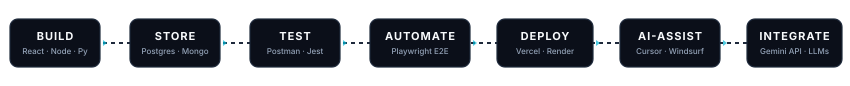

<!--
================================================================================
DESIGN SYSTEM SPECIFICATION
Base Dark:        #0B0F19 (Deep Obsidian)
Surface Dark:     #0F172A (Rich Slate Navy)
Surface Border:   #1E293B (Subtle Steel Border)
Primary Accent:   #6366F1 -> #818CF8 (Electric Violet / Indigo)
Secondary Accent: #06B6D4 -> #38BDF8 (Radiant Cyan / Teal)
Text Primary:     #F8FAFC (Dark) / #0F172A (Light)
Text Muted:       #94A3B8 (Dark) / #475569 (Light)
Status Accent:    #10B981 (Active Beacon Emerald)
Typography:       -apple-system, BlinkMacSystemFont, 'Segoe UI', Inter, Roboto, sans-serif
================================================================================
-->

 

 

  

> **Full-Stack Developer Intern building modern web and mobile applications, REST APIs, AI-powered applications, and production-ready software.**

 

**Full-Stack Developer Intern** · [**Godavari Wave Technologies**](https://www.linkedin.com/in/natra-lokesh-493bb63a2/) · **Rajahmundry**, **Andhra Pradesh, India**  
*⏱️ **3 Months** · 🟢 **Currently Working** · Open to Full-Stack Roles & High-Impact Opportunities*

 

  
  
  
  
  
  

  

 

&nbsp;

&nbsp;

&nbsp;

  

 

  

I am a <kbd>Full-Stack Developer</kbd> currently working as a **Full-Stack Developer Intern** at [**Godavari Wave Technologies**](https://www.linkedin.com/in/natra-lokesh-493bb63a2/) in **Rajahmundry, Andhra Pradesh, India**.

I build scalable software solutions spanning the entire engineering lifecycle: **frontend, backend, APIs, databases, testing, deployment and mobile development**.

My strongest core competencies center on `React`, `JavaScript`, `Python`, and `Django REST Framework`, with working knowledge of `Node.js`, `Express.js`, `TypeScript`, `PostgreSQL`, and `MongoDB`. I actively build cross-platform mobile experiences with **React Native**, design and validate **REST APIs**, automate browser workflows with **Playwright**, ship to modern cloud platforms, and leverage AI-assisted engineering tools (<kbd>Cursor</kbd>, <kbd>Kiro</kbd>, <kbd>Antigravity</kbd>, <kbd>Windsurf</kbd>, <kbd>TRIM</kbd>) to accelerate delivery velocity and architectural rigor.

 

<table width="100%">
  <tr>
    <td width="50%" valign="top">
      <h4>🌐 FULL-STACK WEB</h4>
      <b>React</b> • <b>JavaScript</b> • <b>Tailwind CSS</b> • <b>Redux</b> • <b>Zustand</b> 
      Engineering modular client architectures, responsive interfaces, and high-performance state workflows.
        
      <h4>⚙️ BACKEND &amp; REST APIs</h4>
      <b>Python</b> • <b>Django REST Framework</b> • <b>Node.js</b> • <b>Express.js</b> 
      Architecting secure <b>REST APIs</b>, token authentication flows, route validation, and controllers.
    </td>
    <td width="50%" valign="top">
      <h4>📱 MOBILE &amp; DATABASES</h4>
      <b>React Native</b> • <b>PostgreSQL</b> • <b>MongoDB</b> • <b>Supabase</b> • <b>Firebase</b> 
      Cross-platform iOS &amp; Android mobile development, relational schema design, and document stores.
        
      <h4>🧪 QUALITY, AUTOMATION &amp; CLOUD</h4>
      <b>Playwright</b> • <b>Postman</b> • <b>Vercel</b> • <b>Render</b> • <b>Cloudflare</b> • <b>GitHub</b> 
      End-to-end browser automation, API contract validation, CI/CD git workflows, and cloud releases.
    </td>
  </tr>
</table>

 

 

  

<table width="100%">
  <tr>
    <td>
      <h3 style="margin-top:0;">💼 Full-Stack Developer Intern</h3>
      <b><a href="https://www.linkedin.com/in/natra-lokesh-493bb63a2/">Godavari Wave Technologies</a></b> &nbsp;•&nbsp; 📍 <b>Rajahmundry, Andhra Pradesh, India</b> 
      ⏱️ <b>3 Months</b> &nbsp;•&nbsp; 🟢 <b>Currently Working</b>
        
      • <b>Frontend Architecture:</b> Developing modular, responsive client applications in <b>React</b> with clean component state and modern UI patterns. 
      • <b>Backend &amp; REST APIs:</b> Engineering secure server-side routes and controllers using <b>Node.js</b> and <b>Express.js</b>, enforcing route validation and authorization. 
      • <b>Databases &amp; Integration:</b> Implementing data modeling and queries with <b>MongoDB</b> and relational persistence, wiring client views to server state. 
      • <b>API Testing &amp; Quality:</b> Validating API request/response contracts, status codes, and error handlers using <b>Postman</b>. 
      • <b>Cloud Deployment:</b> Managing Git collaboration workflows and deploying production web services to <b>Vercel</b> and <b>Render</b>.
    </td>
  </tr>
</table>

 

 

  

<!-- Card 1: AI Chatbot Assistant -->
<table width="100%">
  <tr>
    <td>
      <b>✨ #1 · AI Chatbot Assistant</b> &nbsp; <code>Contextual LLM Application</code>
        
      
      
      
      
        
      Full-stack conversational AI application integrating the <b>Google Gemini API</b> with multi-turn chat streaming, persistent user sessions, and contextual PDF document parsing.
        
      
      &nbsp;
      
        
      

        
<b>🔍 View Architecture &amp; Key Highlights</b>

         
        • <b>Conversational AI Streaming:</b> Multi-turn conversational intelligence powered directly by the <b>Google Gemini API</b> (<code>@google/genai</code>) with prompt grounding. 
        • <b>Document Intelligence:</b> Ingestion and text parsing of uploaded PDF files via <code>pdf-parse</code> and <code>multer</code> for document-grounded context Q&amp;A. 
        • <b>Authenticated User Persistence:</b> User authentication powered by <b>JWT</b> (<code>jsonwebtoken</code>) and <code>bcryptjs</code> password hashing with multi-conversation thread histories stored in <b>MongoDB Atlas</b>. 
        • <b>Production API Hardening:</b> Strict route rate limiting configured with <code>express-rate-limit</code> and HTTP security headers enforced via <b>Helmet</b>. 
        • <b>Modern Client Interface:</b> Interactive chat UI built with <b>React 19</b>, <b>Vite</b>, <code>react-markdown</code>, and <code>remark-gfm</code> for formatted code responses. 
         
        <b>Technology Stack:</b> <code>React 19</code> • <code>Vite</code> • <code>Node.js</code> • <code>Express.js</code> • <code>Google Gemini API</code> • <code>MongoDB Atlas</code> • <code>JWT</code> • <code>PDF-Parse</code> • <code>Helmet</code> • <code>Vercel</code> • <code>Render</code>
      

    </td>
  </tr>
</table>

 

<!-- Card 2: MERN E-Commerce -->
<table width="100%">
  <tr>
    <td>
      <b>🛒 #2 · MERN Multi-Tier E-Commerce Platform</b> &nbsp; <code>Enterprise Commerce</code>
        
      
      
      
      
        
      Complete commerce architecture featuring an independent customer storefront, dedicated seller portal, and an Express REST API.
        
      
      
      
      
        
      

        
<b>🔍 View Architecture &amp; Key Highlights</b>

         
        • <b>Multi-Tier Architecture:</b> Engineered separated customer storefront and merchant management dashboard connected to a centralized <b>Express.js</b> <b>REST API</b>. 
        • <b>Dual Authentication:</b> Implemented secure <b>JWT</b> token sessions alongside <b>Google OAuth</b> (<code>google-auth-library</code>) for seamless user authentication. 
        • <b>Commerce Operations:</b> Real-time cart calculations, order lifecycle management, and atomic inventory stock tracking in <b>MongoDB</b>. 
        • <b>Payments &amp; Document Automation:</b> Integrated <b>Razorpay</b> checkout workflows, <b>Cloudinary</b> media storage, and automated PDF invoice generation with <b>PDFKit</b>. 
        • <b>Production Resilience:</b> Configured <b>Redis</b>-backed route rate limiting (<code>rate-limit-redis</code>) and <b>Helmet</b> security headers. 
         
        <b>Technology Stack:</b> <code>MongoDB</code> • <code>Express.js</code> • <code>React</code> • <code>Node.js</code> • <code>Redis</code> • <code>Razorpay</code> • <code>Cloudinary</code> • <code>PDFKit</code> • <code>Google OAuth</code> • <code>Vercel</code> • <code>Render</code>
      

    </td>
  </tr>
</table>

 

<!-- Card 3: ApexStore -->
<table width="100%">
  <tr>
    <td>
      <b>⚡ #3 · ApexStore — React + Django REST Framework</b> &nbsp; <code>Python &amp; PostgreSQL</code>
        
      
      
      
      
        
      API-driven e-commerce platform pairing a type-safe TypeScript React frontend with a PostgreSQL-backed Django REST API.
        
      
      &nbsp;
      
        
      

        
<b>🔍 View Architecture &amp; Key Highlights</b>

         
        • <b>Relational Backend:</b> Structured <b>Django REST Framework</b> API on <b>PostgreSQL</b> modeling products, categories, orders, and addresses. 
        • <b>Authentication Integrity:</b> Secure token authentication powered by <b>Django SimpleJWT</b> with refresh workflows and user session protection. 
        • <b>Type-Safe Client:</b> Component-driven frontend engineered with <b>React</b>, <b>TypeScript</b>, and <b>Vite</b> for strict contract integrity. 
        • <b>Payments &amp; Media:</b> Integrated <b>Razorpay</b> checkout transactions and <b>Cloudinary</b> media pipelines for high-resolution product catalogs. 
         
        <b>Technology Stack:</b> <code>React</code> • <code>TypeScript</code> • <code>Python</code> • <code>Django REST Framework</code> • <code>PostgreSQL</code> • <code>SimpleJWT</code> • <code>Razorpay</code> • <code>Cloudinary</code> • <code>Vercel</code> • <code>Render</code>
      

    </td>
  </tr>
</table>

 

<!-- Card 4: DeskHub -->
<table width="100%">
  <tr>
    <td>
      <b>🛡️ #4 · DeskHub — Customer &amp; Support Agent System</b> &nbsp; <code>RBAC &amp; Automated Testing</code>
        
      
      
      
      
        
      Full-stack helpdesk platform featuring server-side Role-Based Access Control, end-to-end TypeScript, and automated testing.
        
      
      &nbsp;
      
        
      

        
<b>🔍 View Architecture &amp; Key Highlights</b>

         
        • <b>Role-Based Access Control:</b> Server-enforced RBAC separating Customer ticket creation from Support Agent resolution queues. 
        • <b>End-to-End TypeScript:</b> Unified contracts across <b>React</b> and <b>Node.js</b>/<b>Express.js</b> with <b>Zod</b> schema payload validation. 
        • <b>Automated Testing Suite:</b> Comprehensive integration tests written in <b>Jest</b> and <b>Supertest</b> running against an in-memory <b>MongoDB</b> instance. 
        • <b>Lifecycle Triage:</b> Real-time ticket status tracking (<code>Open</code>, <code>In Progress</code>, <code>Resolved</code>) with responsive dashboard views. 
         
        <b>Technology Stack:</b> <code>React</code> • <code>TypeScript</code> • <code>Node.js</code> • <code>Express.js</code> • <code>MongoDB</code> • <code>Zod</code> • <code>Jest</code> • <code>Supertest</code> • <code>Vercel</code>
      

    </td>
  </tr>
</table>

 

<!-- Card 5: Dilip Optics Grand -->
<table width="100%">
  <tr>
    <td>
      <b>👓 #5 · Dilip Optics Grand — Commercial Client Platform</b> &nbsp; <code>Production Solution</code>
        
      
      
      
      
        
      High-performance, mobile-first web application engineered for an optical showroom in Rajahmundry.
        
      
      &nbsp;
      
        
      

        
<b>🔍 View Architecture &amp; Key Highlights</b>

         
        • <b>Modern Frontend:</b> High-speed client interface built with <b>React 19</b>, <b>Vite 8</b>, and <b>Tailwind CSS 4</b> for sub-second mobile rendering. 
        • <b>Image Pipeline:</b> Automated <b>Node.js</b> and <b>Sharp</b> script converting raw eyewear photography to lightweight WebP formats. 
        • <b>Commercial Lead Gen:</b> One-tap WhatsApp appointment and product inquiry workflows driving direct showroom foot traffic. 
        • <b>Local Business SEO:</b> Structured JSON-LD schema markup configured for high search engine visibility in <b>Rajahmundry</b>. 
         
        <b>Technology Stack:</b> <code>React 19</code> • <code>Vite 8</code> • <code>Tailwind CSS 4</code> • <code>Node.js</code> • <code>Sharp</code> • <code>Lucide React</code> • <code>Vercel</code>
      

    </td>
  </tr>
</table>

 

<!-- Small Projects Grid -->
<table width="100%">
  <tr>
    <td width="33%" valign="top">
      <b>ProStackHub CartCraft</b> 
      <b>MERN</b> E-Commerce Platform  
       
      Stripe Checkout · RBAC · Cloudinary  
      
      
    </td>
    <td width="33%" valign="top">
      <b>ShelfLife Library</b> 
      Personal Reading &amp; Shelf Tracker  
       
      React · Node.js · Express.js · MongoDB  
      
      
    </td>
    <td width="33%" valign="top">
      <b>Expense Tracker</b> 
      Financial Visualization Dashboard  
       
      React · Spending Analytics  
      
      
    </td>
  </tr>
</table>

 

 

  

The technical stack is organized across the end-to-end software development lifecycle: architecture design, database persistence, automated verification, cloud deployment, and AI-assisted velocity.

 

### Engineering Lifecycle

   STORE > TEST > AUTOMATE > DEPLOY > AI-ASSIST > INTEGRATE" />

* **BUILD** → Developing web, mobile, and backend applications with **React**, **React Native**, **Node.js**, **Express.js**, and **Django REST Framework**.
* **STORE** → Relational data modeling and document stores using **PostgreSQL**, **MongoDB**, **Supabase**, and **Firebase**.
* **TEST** → Validating endpoint contracts, JWT headers, and schemas using **Postman**, **Bruno**, and **Thunder Client**.
* **AUTOMATE** → Executing automated end-to-end browser journeys and integration suites with **Playwright**.
* **DEPLOY** → Deploying resilient serverless and containerized services to **Vercel**, **Netlify**, **Render**, **Railway**, and **Cloudflare**.
* **AI-ASSIST** → Leveraging modern AI-augmented workflows (**Cursor**, **Kiro**, **Antigravity**, **Windsurf**, **TRIM**) for typing precision and code velocity.
* **INTEGRATE** → Integrating production-ready generative AI APIs, including the **Google Gemini API**, for contextual intelligence.

 

  

<table width="100%">
  <tr>
    <td width="28%"><b>🔤 Languages</b></td>
    <td>
      
    </td>
  </tr>
  <tr>
    <td><b>🌐 Frontend</b></td>
    <td>
      
    </td>
  </tr>
  <tr>
    <td><b>⚙️ Backend &amp; APIs</b></td>
    <td>
      
    </td>
  </tr>
  <tr>
    <td><b>📱 Mobile</b></td>
    <td>
      
    </td>
  </tr>
  <tr>
    <td><b>🗄️ Databases &amp; Services</b></td>
    <td>
      
    </td>
  </tr>
  <tr>
    <td><b>🧪 Testing &amp; Quality</b></td>
    <td>
      
      &nbsp;
      
      
    </td>
  </tr>
  <tr>
    <td><b>☁️ Cloud &amp; Deployment</b></td>
    <td>
      
    </td>
  </tr>
  <tr>
    <td><b>🛠️ Development Tools</b></td>
    <td>
      
    </td>
  </tr>
  <tr>
    <td><b>🤖 AI-Assisted Workflows</b></td>
    <td>
      
      
      
      
      
      
    </td>
  </tr>
</table>

 

  
<b>Full capability list</b>

   
  <table width="100%">
    <tr>
      <td width="28%"><b>LANGUAGES</b></td>
      <td><b>JavaScript</b> • <b>TypeScript</b> • <b>Python</b> • <b>HTML5</b> • <b>CSS3</b></td>
    </tr>
    <tr>
      <td><b>FRONTEND</b></td>
      <td><b>React</b> • <b>Tailwind CSS</b> • <b>Redux</b> • <b>Zustand</b></td>
    </tr>
    <tr>
      <td><b>BACKEND &amp; APIs</b></td>
      <td><b>Django REST Framework</b> • <b>Node.js</b> • <b>Express.js</b> • <b>REST APIs</b></td>
    </tr>
    <tr>
      <td><b>MOBILE</b></td>
      <td><b>React Native</b> <i>(Cross-platform iOS &amp; Android mobile application development)</i></td>
    </tr>
    <tr>
      <td><b>DATABASES &amp; SERVICES</b></td>
      <td><b>PostgreSQL</b> • <b>MongoDB</b> • <b>Supabase</b> • <b>Firebase</b></td>
    </tr>
    <tr>
      <td><b>DEVELOPMENT TOOLS</b></td>
      <td><b>Git</b> • <b>GitHub</b> • <b>VS Code</b></td>
    </tr>
    <tr>
      <td><b>API TESTING &amp; DEBUGGING</b></td>
      <td><b>Postman</b> • <b>Bruno</b> • <b>Thunder Client</b></td>
    </tr>
    <tr>
      <td><b>TEST AUTOMATION &amp; E2E</b></td>
      <td><b>Playwright</b></td>
    </tr>
    <tr>
      <td><b>CLOUD &amp; DEPLOYMENT</b></td>
      <td><b>Vercel</b> • <b>Netlify</b> • <b>Render</b> • <b>Railway</b> • <b>Cloudflare</b></td>
    </tr>
    <tr>
      <td><b>AI-ASSISTED DEVELOPMENT</b></td>
      <td><b>Cursor</b> • <b>Kiro</b> • <b>Antigravity</b> • <b>Windsurf</b> • <b>TRIM</b> <i>(Augmented engineering workflows)</i></td>
    </tr>
    <tr>
      <td><b>AI &amp; API INTEGRATION</b></td>
      <td><b>Gemini API</b> <i>(Google Gemini API integration verified in production applications)</i></td>
    </tr>
  </table>

 

> *Note on AI Workflows: AI-assisted development tools (Cursor, Kiro, Antigravity, Windsurf, TRIM) represent modern augmented engineering workflows for development speed, schema verification, and automated refactoring—not standalone programming languages or AI engineering claims.*

 

 

  

<table width="100%">
  <tr>
    <td width="50%" valign="top">
      <h4>🎓 AI Fluency for Builders</h4>
      <b>Anthropic Academy</b> 
      Practical foundations in building applications with Large Language Models, prompt engineering architectures, context window management, and agentic workflows.
        
      <h4>🌐 Cisco Networking Academy</h4>
      <b>Cisco</b> • <b>Cisco Packet Tracer / Networking</b> 
      Core networking fundamentals, IP subnetting, routing protocols, client-server communication models, and network topology simulation.
    </td>
    <td width="50%" valign="top">
      <h4>🏛️ Academic Degree</h4>
      <b>Bachelor of Commerce (B.Com)</b> 
      <b>Andhra University</b> · <i>Online Degree Program</i> 
      Expected Graduation: <b>2029</b>  
      Combining business fundamentals, financial models, and commercial workflows with dedicated <b>Full-Stack software engineering</b> practice.
    </td>
  </tr>
</table>

 

 

  

<picture>
  <source media="(prefers-color-scheme: dark)" srcset="https://github-readme-stats.vercel.app/api?username=lokesh-varma28&show_icons=true&hide_border=true&hide_rank=true&bg_color=0B0F19&title_color=818CF8&icon_color=38BDF8&text_color=94A3B8" />
  <source media="(prefers-color-scheme: light)" srcset="https://github-readme-stats.vercel.app/api?username=lokesh-varma28&show_icons=true&hide_border=true&hide_rank=true&bg_color=F8FAFC&title_color=4F46E5&icon_color=0284C7&text_color=475569" />
  
</picture>
&nbsp;
<picture>
  <source media="(prefers-color-scheme: dark)" srcset="https://github-readme-stats.vercel.app/api/top-langs/?username=lokesh-varma28&layout=compact&hide_border=true&langs_count=6&bg_color=0B0F19&title_color=818CF8&text_color=94A3B8" />
  <source media="(prefers-color-scheme: light)" srcset="https://github-readme-stats.vercel.app/api/top-langs/?username=lokesh-varma28&layout=compact&hide_border=true&langs_count=6&bg_color=F8FAFC&title_color=4F46E5&text_color=475569" />
  
</picture>

  

<picture>
  <source media="(prefers-color-scheme: dark)" srcset="https://raw.githubusercontent.com/lokesh-varma28/lokesh-varma28/output/github-snake-dark.svg" />
  <source media="(prefers-color-scheme: light)" srcset="https://raw.githubusercontent.com/lokesh-varma28/lokesh-varma28/output/github-snake.svg" />
  
</picture>

 

 

  

**Open to Full-Stack Developer Roles, Internships, Freelance Projects, and Technical Collaborations.**

 

&nbsp;

&nbsp;

&nbsp;

&nbsp;

  

[Portfolio](https://my-portfolio-one-gold-42.vercel.app/) &nbsp;•&nbsp; [GitHub](https://github.com/lokesh-varma28) &nbsp;•&nbsp; [LinkedIn](https://www.linkedin.com/in/natra-lokesh-493bb63a2/) &nbsp;•&nbsp; [Email](mailto:lokeshvarmakshatriya@gmail.com)

  

Always Building · Always Learning · Always Shipping

  

