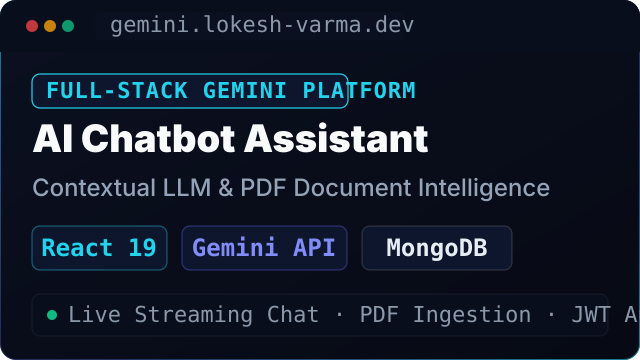
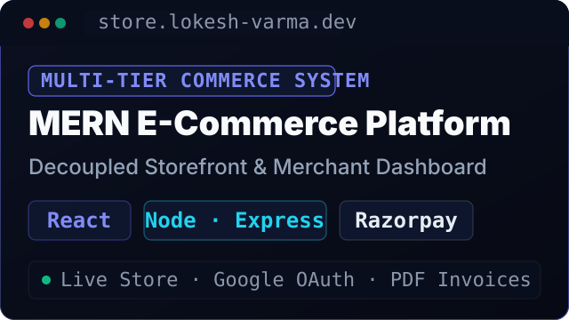
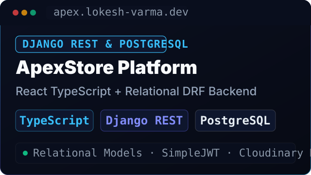
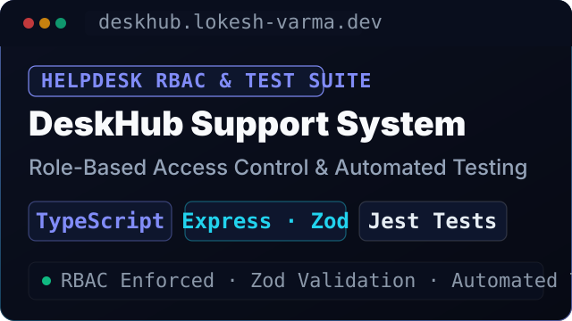

 

  
  &nbsp;
  
  &nbsp;
  

  
  &nbsp;
  

 

 

  

<!-- Project 1: AI Chatbot Assistant -->

### 01 · AI Chatbot Assistant
**Contextual Google Gemini LLM assistant with multi-turn chat streaming, in-memory PDF parsing, and authenticated sessions.**

`React 19` · `Gemini API` · `MongoDB Atlas`

[**Live Demo &rarr;**](https://ai-chatbot-f3t9.vercel.app/) &nbsp;|&nbsp; [**Source Code &rarr;**](https://github.com/lokesh-varma28/ai-chatbot)

  
<b>Key architecture &amp; highlights</b>

   

- **Conversational Streaming:** Real-time multi-turn conversational AI powered by `@google/genai` with prompt grounding.
- **Document Intelligence:** In-memory PDF text ingestion and chunking via `pdf-parse` for contextual Q&amp;A.
- **Session Architecture:** JWT authentication with hashed credentials and persistent chat history in MongoDB Atlas.
- **API Hardening:** Enforced rate limiting via `express-rate-limit` and HTTP security headers with Helmet.

 

<!-- Project 2: MERN Multi-Tier E-Commerce Platform -->

### 02 · MERN Multi-Tier E-Commerce Platform
**Multi-tier commerce architecture featuring independent customer storefront, merchant seller portal, and Razorpay checkout.**

`React` · `Node.js` · `MongoDB Atlas`

[**Live Demo &rarr;**](https://mern-full-stack-ecommerce.vercel.app) &nbsp;|&nbsp; [**Source Code &rarr;**](https://github.com/lokesh-varma28/Mern-Full-Stack-Ecommerce)

  
<b>Key architecture &amp; highlights</b>

   

- **Multi-Tier Architecture:** Decoupled customer storefront and merchant dashboard communicating via a centralized REST API.
- **Dual Authentication:** JWT session management alongside Google OAuth for secure multi-provider access.
- **Commerce Operations:** Real-time cart synchronization, structured order lifecycles, and atomic stock tracking in MongoDB Atlas.
- **Payments &amp; Media:** Integrated Razorpay checkout, Cloudinary media pipelines, and server-side PDF invoice generation with PDFKit.

 

<!-- Project 3: ApexStore -->

### 03 · ApexStore — React + Django REST Framework
**API-driven e-commerce platform pairing a type-safe TypeScript React frontend with a relational PostgreSQL Django REST Framework API.**

`TypeScript React` · `Django REST` · `PostgreSQL`

[**Live Demo &rarr;**](https://apexstore-frontend.vercel.app) &nbsp;|&nbsp; [**Source Code &rarr;**](https://github.com/lokesh-varma28/Full-Stack-DRF-React)

  
<b>Key architecture &amp; highlights</b>

   

- **Relational Backend Engine:** Structured Django REST Framework API on PostgreSQL modeling products, orders, and customer accounts.
- **Authentication Integrity:** Secure token authentication and renewal workflows powered by Django SimpleJWT.
- **Type-Safe Frontend:** Component architecture built with React, TypeScript, and Vite ensuring client-server contract consistency.
- **Payments &amp; Media:** Integrated Razorpay payment processing and Cloudinary media pipelines for catalog assets.

 

<!-- Project 4: DeskHub -->

### 04 · DeskHub — Helpdesk RBAC & Test Automation
**Full-stack customer ticketing system with server-side Role-Based Access Control, Zod validation, and automated Jest/Supertest integration test coverage.**

`TypeScript` · `Express.js` · `Jest Tests`

[**Live Demo &rarr;**](https://client-chi-six-93.vercel.app) &nbsp;|&nbsp; [**Source Code &rarr;**](https://github.com/lokesh-varma28/ProStackHub_CustomerAgentSystem)

  
<b>Key architecture &amp; highlights</b>

   

- **Role-Based Access Control:** Server-enforced RBAC separating customer ticket creation from agent triage queues.
- **End-to-End TypeScript:** Unified contracts across React and Node.js/Express.js with strict runtime validation using Zod.
- **Automated Testing Suite:** Integration test suite in Jest and Supertest running against an in-memory database.
- **Lifecycle Triage:** Real-time ticket status tracking (`Open`, `In Progress`, `Resolved`) with responsive triage interfaces.

 

 

  

### Full-Stack Developer Intern
**Godavari Wave Technologies** &nbsp;•&nbsp; 📍 Rajahmundry, Andhra Pradesh, India  
🟢 **Currently Working** &nbsp;•&nbsp; ⏱️ **3 Months**

- **Frontend Engineering:** Architecting and implementing modular, responsive client applications in **React** with structured component architecture and clean state management.
- **Backend &amp; REST APIs:** Engineering server-side routes, middleware, and controllers using **Node.js** and **Express.js**, enforcing payload validation and authorization rules.
- **Data Modeling &amp; Contracts:** Designing data models and queries with **MongoDB**, connecting API endpoints to frontend views, and validating REST contracts using **Postman**.

 

 

  

  

**Active Focus:** `React Native` (cross-platform mobile) &nbsp;•&nbsp; `Playwright` (end-to-end automation) &nbsp;•&nbsp; `Gemini API` (LLM agents)

> Disciplined engineering with AI-assisted acceleration, verifying every commit with automated tests.

 

 

<!-- Tier 3: Compact & Collapsible -->

  
<b>📦 More Projects, Education &amp; Background</b>

   

  ### Additional Projects

  #### Dilip Optics Grand · Client Solution
  Mobile-first retail catalog engineered for an optical showroom in Rajahmundry with automated Sharp WebP image processing and instant WhatsApp appointment inquiry routing.  
  `React 19` · `Tailwind CSS` · `Sharp`  
  [**Live Website &rarr;**](https://dilip-opticals-website.vercel.app/) &nbsp;|&nbsp; [**Source Code &rarr;**](https://github.com/lokesh-varma28/dilip-opticals-website)

   

  #### ProStackHub CartCraft · MERN E-Commerce
  Full-featured e-commerce platform with persistent cart state, Stripe checkout, admin RBAC, inventory control, and Cloudinary media pipelines.  
  `React` · `Node.js` · `MongoDB`  
  [**Live Demo &rarr;**](https://frontend-silk-two-32.vercel.app/) &nbsp;|&nbsp; [**Source Code &rarr;**](https://github.com/lokesh-varma28/ProStackHub-CartCraft)

   

  #### ShelfLife Library · Bookshelf Tracker
  Personal reading progress and bookshelf tracker built with React, Node.js, Express, and MongoDB for categorized reading triage.  
  `React` · `Node.js` · `Express` · `MongoDB`  
  [**Live Demo &rarr;**](https://pro-stack-hub-shelf-life-ten.vercel.app) &nbsp;|&nbsp; [**Source Code &rarr;**](https://github.com/lokesh-varma28/ProStackHub_ShelfLife)

   

  #### Expense Tracker · Financial Dashboard
  Personal financial dashboard for managing income, expenditures, and monthly spending categories with clean interactive data visualization.  
  `React` · `JavaScript` · `CSS3`  
  [**Live Demo &rarr;**](https://expense-tracker-dashboard-beta.vercel.app) &nbsp;|&nbsp; [**Source Code &rarr;**](https://github.com/lokesh-varma28/expense-tracker-dashboard)

   

  ### Education &amp; Certifications

  #### Bachelor of Commerce (B.Com)
  **Andhra University** — *Online Degree Program* &nbsp;•&nbsp; Expected Graduation: **2029**  
  Integrating commercial fundamentals, financial systems, and business workflows with dedicated full-stack software development practice.

   

  #### AI Fluency for Builders
  **Anthropic Academy**  
  Foundations in Large Language Models, prompt architectures, and agentic engineering workflows.

   

  #### Cisco Networking Academy
  **Cisco Packet Tracer / Networking**  
  Core networking fundamentals, IP addressing, routing protocols, and client-server architecture.

 

 

  

> **Open to Full-Stack Developer roles, internships, freelance projects, and technical collaborations.**

 

  
  &nbsp;
  
  &nbsp;
  

  
  &nbsp;
  

 

